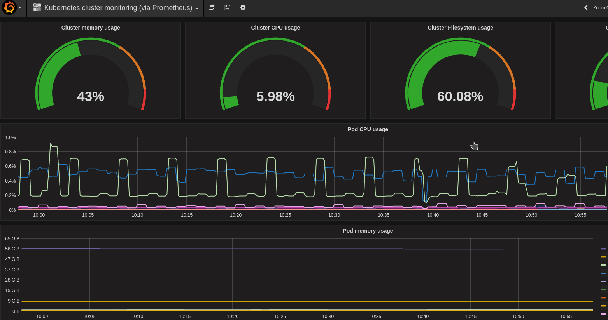

See also [Elasticsearch+Kibana Kubernetes complete example](https://github.com/kayrus/elk-kubernetes)

# Prerequisites

## Kubectl

`kubectl` should be configured.

## Namespace

This example uses `monitoring` namespace. If you wish to use your own namespace, just export `NAMESPACE=mynamespace` environment variable.

## Upload etcd TLS keypair

In case when you use TLS keypair and TLS auth for your etcd cluster, please put corresponding TLS keypair into the `etcd-tls-client-certs` secrets:

```sh
kubectl --namespace=monitoring create secret generic --from-file=ca.pem=/path/to/ca.pem --from-file=client.pem=/path/to/client.pem --from-file=client-key.pem=/path/to/client-key.pem etcd-tls-client-certs
```

otherwise create a dummy secret:

```sh
kubectl --namespace=monitoring create secret generic --from-literal=ca.pem=123 --from-literal=client.pem=123 --from-literal=client-key.pem=123 etcd-tls-client-certs
```

## Upload Ingress controller server TLS keypairs

In order to provide secure endpoint available trough the Internet you have to set `example-tls` secret inside the `monitoring` Kubernetes namespace.

```sh
kubectl create --namespace=monitoring secret tls example-tls --cert=cert.crt --key=key.key
```

Detailed information is available [here](https://github.com/kubernetes/contrib/tree/master/ingress/controllers/nginx/examples/tls). [Ingress manifest example](#ingress-controller).

## Create Ingress basic auth entry

With the `internal-services-auth` name. More info is [here](https://github.com/kubernetes/contrib/tree/master/ingress/controllers/nginx/examples/auth). [Ingress manifest example](#ingress-controller).

## Set proper external URLs to have correct links in notifications

Run `EXTERNAL_URL=https://my-external-prometheus.example.com ./deploy.sh` to deploy Prometheus monitoring configured to use `https://my-external-prometheus.example.com` base URL. Otherwise it will use default value: `https://prometheus.example.com`.

## Assumptions

### Disk mount points

This repo assumes that your Kubernetes worker nodes contain two observable mount points:

* root mount point `/` which is mounted as readonly `/root-disk` inside the [`node-exporter`](node-exporter-ds.yaml) pod
* data mount point `/localdata` which is mounted as readonly `/data-disk` inside the [`node-exporter`](node-exporter-ds.yaml) pod

If you wish to change these values, you have to modify [`node-exporter-ds.yaml`](node-exporter-ds.yaml), [`prometheus-rules/low-disk-space.rules`](prometheus-rules/low-disk-space.rules), [`grafana-import-dashboards-configmap`](grafana-import-dashboards-configmap) and then [rebuild](#rebuild-configmaps-manifests) configmap manifests before you run `./deploy.sh` script.

### Data storage

This repo uses `emptyDir` data storage which means that every pod restart will cause **data loss**. In case when you wish to use persistant storage please modify the following manifests correspondingly:

* [`prometheus-deployment.yaml`](prometheus-deployment.yaml)
* [`alertmanager-deployment.yaml`](alertmanager-deployment.yaml)
* [`grafana-deployment.yaml`](grafana-deployment.yaml)

### Grafana dashboards

Initial Grafana dashboards were taken from this [repo](https://github.com/giantswarm/kubernetes-prometheus) and adjusted.

# Ingress controller

Example of an ingress controller to get an access from outside:

```yaml
apiVersion: extensions/v1beta1
kind: Ingress
metadata:
  annotations:
    ingress.kubernetes.io/auth-realm: Authentication Required
    ingress.kubernetes.io/auth-secret: internal-services-auth
    ingress.kubernetes.io/auth-type: basic
    kubernetes.io/ingress.allow-http: "false"
  name: ingress-monitoring
  namespace: monitoring
spec:
  tls:
  - hosts:
    - prometheus.example.com
    - grafana.example.com
    secretName: example-tls
  rules:
  - host: prometheus.example.com
    http:
      paths:
      - path: /
        backend:
          serviceName: prometheus-svc
          servicePort: 9090
      - path: /alertmanager
        backend:
          serviceName: alertmanager
          servicePort: 9093
  - host: grafana.example.com
    http:
      paths:
      - path: /
        backend:
          serviceName: grafana
          servicePort: 3000
```

If you still don't have an Ingress controller installed, you can use manifests from the [`test_ingress`](test_ingress) directory for test purposes.

# Alerting

## Included alert rules

Prometheus alert rules which are already included in this repo:

* NodeCPUUsage > 50%
* NodeLowRootDisk > 80% (relates to `/root-disk` mount point inside `node-exporter` pod)
* NodeLowDataDisk > 80% (relates to `/data-disk` mount point inside `node-exporter` pod)
* NodeSwapUsage > 10%
* NodeMemoryUsage > 75%
* ESLogsStatus (alerts when Elasticsearch cluster status goes yellow or red)
* NodeLoadAverage (alerts when node's load average divided by amount of CPUs exceeds 1)

## Notifications

[`alertmanager-configmap.yaml`](alertmanager-configmap.yaml) contains `smtp_*` and `slack_*` inside the `global` sections. Adjust them to meet your needs.

# Updating configuration

## Prometheus configuration

### Update command line parameters

Modify [`prometheus-deployment.yaml`](prometheus-deployment.yaml) and apply a manifest:

```sh
kubectl --namespace=monitoring apply -f prometheus-deployment.yaml
```

If deployment manifest was changed, all Prometheus pods will be restarted with [data loss](#data-storage).

### Update configfile

Update [`prometheus-configmap.yaml`](prometheus-configmap.yaml) or [`prometheus-rules`](prometheus-rules) directory contents and apply them:

```sh
./update_prometheus_config.sh
# or
./update_prometheus_rules.sh
```

These scripts will update configmaps, wait until changes will be delivered into the pod volume (if the configmap was not changed, this script will work forever) and reload the configs. You can also reload configs manually using the commands below:


```sh
curl -XPOST --user "%username%:%password%" https://prometheus.example.com/-/reload
# or
kubectl --namespace=monitoring exec $(kubectl --namespace=monitoring get pods -l app=prometheus -o jsonpath={.items..metadata.name}) -- killall -HUP prometheus
```

## Alertmanager configuration

### Update command line parameters

Modify [`alertmanager-deployment.yaml`](alertmanager-deployment.yaml) and apply a manifest:

```sh
kubectl --namespace=monitoring apply -f alertmanager-deployment.yaml
```

If deployment manifest was changed, all Alertmanager pods will be restarted with [data loss](#data-storage).

### Update configfile

Update [`alertmanager-configmap.yaml`](alertmanager-configmap.yaml) or [`alertmanager-templates`](alertmanager-templates) directory contents and apply them:

```sh
./update_alertmanager_config.sh
# or
./update_alertmanager_templates.sh
```

These scripts will update configmaps, wait until changes will be delivered into the pod volume (if the configmap was not changed, this script will work forever) and reload the configs. You can also reload configs manually using the commands below:

```sh
curl -XPOST --user "%username%:%password%" https://prometheus.example.com/alertmanager/-/reload
# or
kubectl --namespace=monitoring exec $(kubectl --namespace=monitoring get pods -l app=alertmanager -o jsonpath={.items..metadata.name}) -- killall -HUP alertmanager
```

# Pictures


